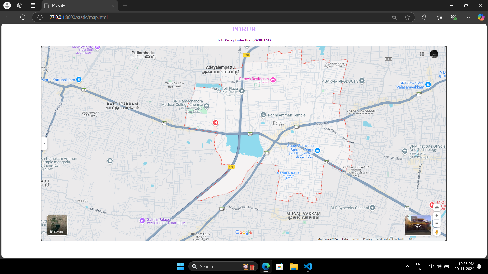
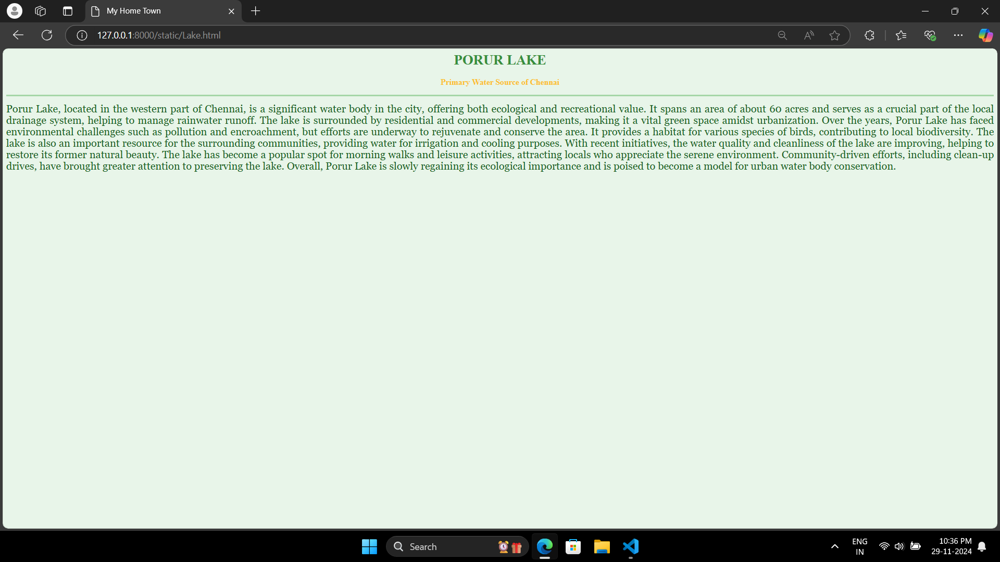
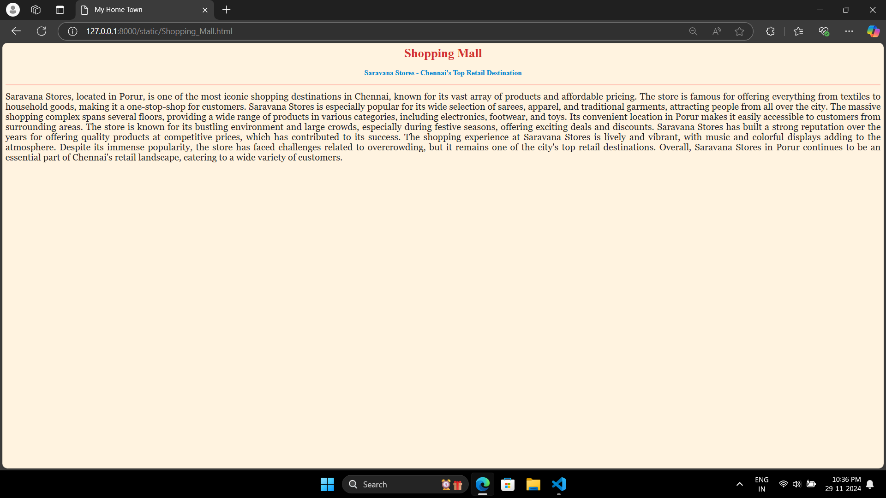
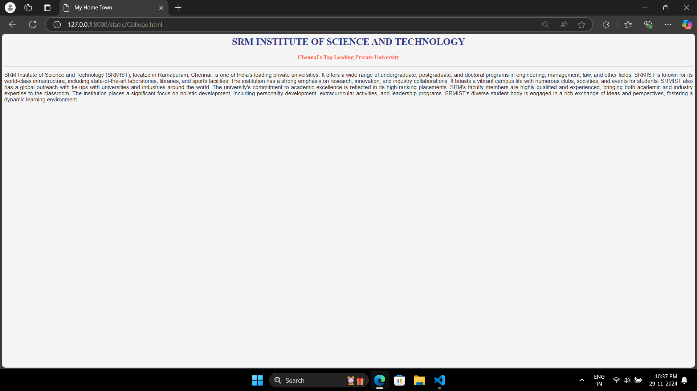

# Ex04 Places Around Me
## Date: 30-11-2024

## AIM
To develop a website to display details about the places around my house.

## DESIGN STEPS

### STEP 1
Create a Django admin interface.

### STEP 2
Download your city map from Google.

### STEP 3
Using ```<map>``` tag name the map.

### STEP 4
Create clickable regions in the image using ```<area>``` tag.

### STEP 5
Write HTML programs for all the regions identified.

### STEP 6
Execute the programs and publish them.

## CODE
# MAP.HTML
```html
<html>
<head>
<title>My City</title>
</head>
<body>
<h1 align="center">
<font color="CF9FFF"><b>PORUR</b></font>
</h1>
<h3 align="center">
<font color="purple"><b>K S Vinay Suhirthan(24901151)</b></font>
</h3>
<center>

<map name="MyCity">
<area shape="rect" coords="1113,563,1327,747" href="home.html" title="My Home (Mangala Nagar)">
<area shape="circle" coords="1135,340,100" href="Temple.html" title="Temple">
<area shape="circle" coords="1278,444,103" href="Shopping_Mall.html" title="Shopping_Mall">
<area shape="circle" coords="1803,508,100" href="College.html" title="College">
<area shape="rect" coords="856,410,1059,541" href="Lake.html" title="Lake">
</center>
</body>
</html>


```
# LAKE.HTML
```html
<html>
<head>
<title>My Home Town</title>
</head>
<body bgcolor="#e8f5e9">
<h1 align="center">
<font color="#388e3c"><b>PORUR LAKE</b></font>
</h1>
<h3 align="center">
<font color="#fbc02d"><b>Primary Water Source of Chennai</b></font>
</h3>
<hr size="3" color="#a5d6a7">
<p align="justify">
<font face="Georgia" size="5" color="#1b5e20">

Porur Lake, located in the western part of Chennai, is a significant water body in the city, offering both ecological and recreational value. It spans an area of about 60 acres and serves as a crucial part of the local drainage system, helping to manage rainwater runoff. The lake is surrounded by residential and commercial developments, making it a vital green space amidst urbanization. Over the years, Porur Lake has faced environmental challenges such as pollution and encroachment, but efforts are underway to rejuvenate and conserve the area. It provides a habitat for various species of birds, contributing to local biodiversity. The lake is also an important resource for the surrounding communities, providing water for irrigation and cooling purposes. With recent initiatives, the water quality and cleanliness of the lake are improving, helping to restore its former natural beauty. The lake has become a popular spot for morning walks and leisure activities, attracting locals who appreciate the serene environment. Community-driven efforts, including clean-up drives, have brought greater attention to preserving the lake. Overall, Porur Lake is slowly regaining its ecological importance and is poised to become a model for urban water body conservation.

</font>
</p>
</body>
</html>

```
# TEMPLE.HTML
```html
<html>
<head>
<title>My Home Town</title>
</head>
<body bgcolor="#f3e5f5">
<h1 align="center">
<font color="#8e24aa"><b>PONNI AMMAN KOIL</b></font>
</h1>
<h3 align="center">
<font color="#0288d1"><b>Religious and Cultural Landmark of Porur</b></font>
</h3>
<hr size="3" color="#e1bee7">
<p align="justify">
<font face="Georgia" size="5" color="#4a148c">

Ponni Amman Koil, located near Porur, is a famous temple dedicated to Goddess Ponni Amman, a revered deity in the region. The temple stands as an important spiritual center for the local community, attracting visitors and devotees from across Chennai. It is known for its stunning architecture, with intricately designed pillars and sculptures that depict scenes from Hindu mythology. Ponni Amman Koil is a place of tranquility and devotion, with many people visiting it to seek blessings for prosperity and well-being. The temple hosts various religious events and festivals, especially during Tamil New Year and Navaratri, drawing large crowds. Over the years, the temple has become an integral part of the cultural heritage of Porur, with rituals and practices that have been passed down through generations. The serene environment of the temple offers a peaceful respite from the bustling city life. The temple’s location near Porur also makes it easily accessible for the local population. The religious significance of Ponni Amman Koil extends beyond just the local community, as it is a symbol of faith and tradition for many people. With a rich history and vibrant cultural practices, Ponni Amman Koil continues to be a beloved landmark in the area, playing a vital role in the spiritual life of the residents.

</font>
</p>
</body>
</html>


```
# SHOPPING MALL
```html
<html>
<head>
<title>My Home Town</title>
</head>
<body bgcolor="#fff3e0">
<h1 align="center">
<font color="#d32f2f"><b>Shopping Mall</b></font>
</h1>
<h3 align="center">
<font color="#0288d1"><b>Saravana Stores - Chennai's Top Retail Destination</b></font>
</h3>
<hr size="3" color="#ffccbc">
<p align="justify">
<font face="Georgia" size="5" color="#212121">

Saravana Stores, located in Porur, is one of the most iconic shopping destinations in Chennai, known for its vast array of products and affordable pricing. The store is famous for offering everything from textiles to household goods, making it a one-stop-shop for customers. Saravana Stores is especially popular for its wide selection of sarees, apparel, and traditional garments, attracting people from all over the city. The massive shopping complex spans several floors, providing a wide range of products in various categories, including electronics, footwear, and toys. Its convenient location in Porur makes it easily accessible to customers from surrounding areas. The store is known for its bustling environment and large crowds, especially during festive seasons, offering exciting deals and discounts. Saravana Stores has built a strong reputation over the years for offering quality products at competitive prices, which has contributed to its success. The shopping experience at Saravana Stores is lively and vibrant, with music and colorful displays adding to the atmosphere. Despite its immense popularity, the store has faced challenges related to overcrowding, but it remains one of the city's top retail destinations. Overall, Saravana Stores in Porur continues to be an essential part of Chennai's retail landscape, catering to a wide variety of customers.

</font>
</p>
</body>
</html>

```
# HOME.HTML
```html
<html>
<head>
<title>My Home Town</title>
</head>
<body bgcolor="#fff3e0">
<h1 align="center">
<font color="#36454F"><b>Mangala Nagar</b></font>
</h1>
<h3 align="center">
<font color="#FFD700"><b>My Home Town</b></font>
</h3>
<hr size="3" color="#ffccbc">
<p align="justify">
<font face="Georgia" size="5" color="#212121">

Mangala Nadar in Porur is a peaceful, residential area that offers a perfect blend of modern amenities and natural beauty. The locality is known for its friendly, close-knit community, where neighbors know each other well. With plenty of greenery, open spaces, and parks, it provides a calm environment away from the hustle and bustle of city life. The area is well-connected to major roads and public transport, making it easy to commute to other parts of Chennai. Local shops and markets offer everyday conveniences, while nearby schools and hospitals add to its appeal. The Porur Lake is a popular spot for relaxation and outdoor activities. Mangala Nadar is ideal for families, offering a safe, family-oriented atmosphere. The growing infrastructure and development around the area continue to improve living standards. The sense of community and cultural ties make Mangala Nadar a truly special place. It’s a great place to call home, offering both tranquility and convenience.

</font>
</p>
</body>
</html>


</font>
</p>
</body>
</html>

```
# COLLEGE.HTML
```html
<html>
<head>
<title>My Home Town</title>
</head>
<body bgcolor="#f5f5f5">
<h1 align="center">
<font color="#2e3a87"><b>SRM INSTITUTE OF SCIENCE AND TECHNOLOGY</b></font>
</h1>
<h3 align="center">
<font color="#ff6347"><b>Chennai's Top Leading Private University</b></font>
</h3>
<hr size="3" color="#dcdcdc">
<p align="justify">
<font face="Arial, sans-serif" size="4" color="#333333">

SRM Institute of Science and Technology (SRMIST), located in Ramapuram, Chennai, is one of India's leading private universities. It offers a wide range of undergraduate, postgraduate, and doctoral programs in engineering, management, law, and other fields. SRMIST is known for its world-class infrastructure, including state-of-the-art laboratories, libraries, and sports facilities. The institution has a strong emphasis on research, innovation, and industry collaborations. It boasts a vibrant campus life with numerous clubs, societies, and events for students. SRMIST also has a global outreach with tie-ups with universities and industries around the world. The university's commitment to academic excellence is reflected in its high-ranking placements. SRM's faculty members are highly qualified and experienced, bringing both academic and industry expertise to the classroom. The institution places a significant focus on holistic development, including personality development, extracurricular activities, and leadership programs. SRMIST's diverse student body is engaged in a rich exchange of ideas and perspectives, fostering a dynamic learning environment.

</font>
</p>
</body>
</html>


```

## OUTPUT








## RESULT
The program for implementing image maps using HTML is executed successfully.
